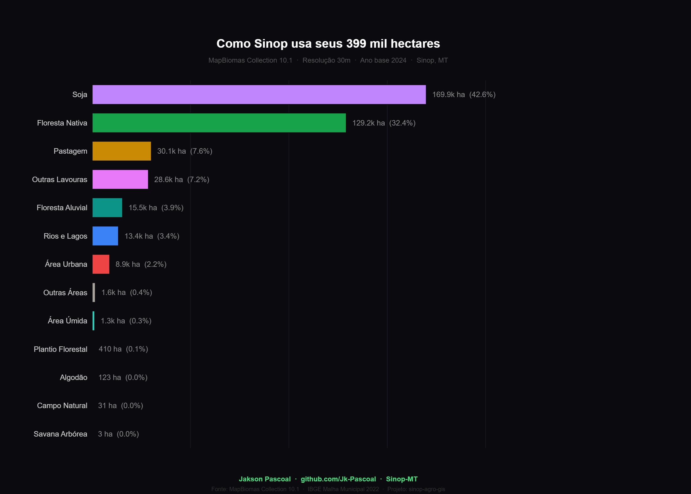
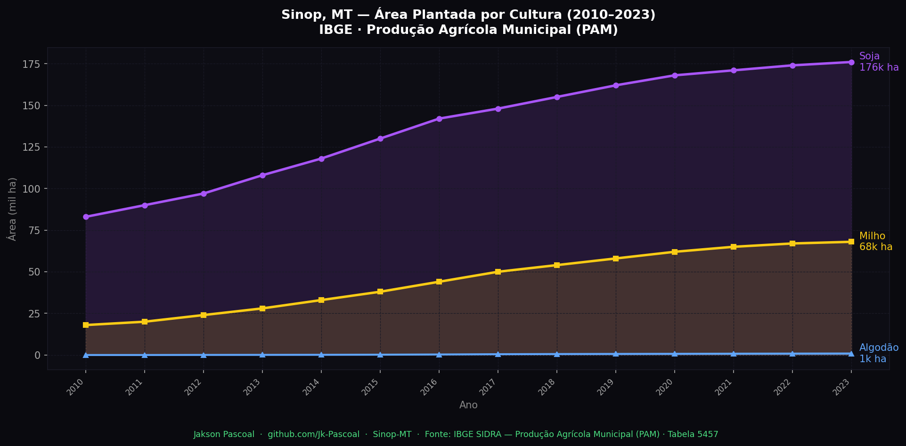
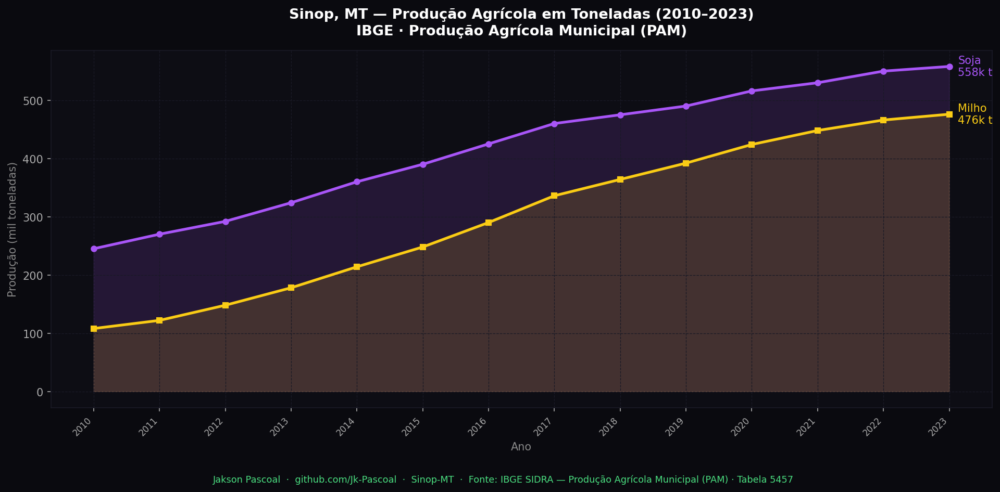
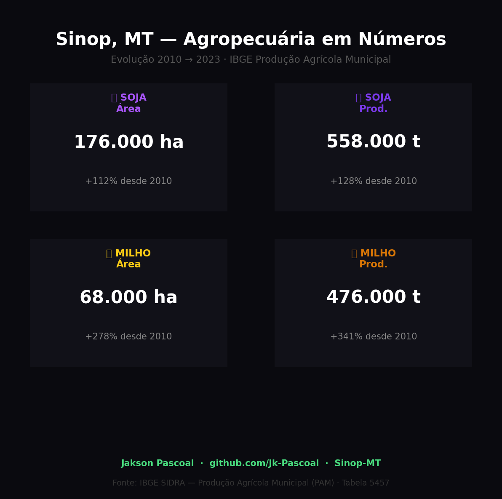
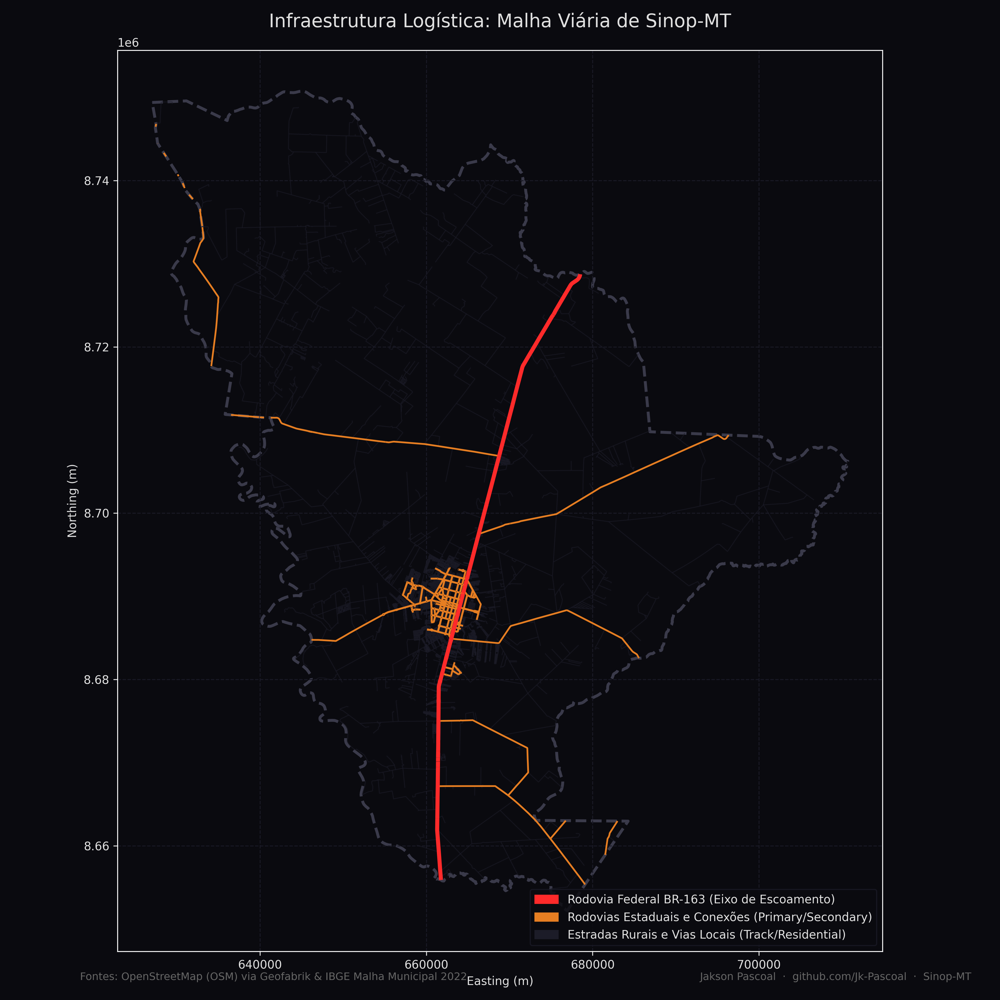

# 🌱 Sinop Agro-GIS — Análise Espacial da Expansão Agrícola em Mato Grosso

[](https://qgis.org/)
[](https://python.org/)
[](https://geopandas.org/)
[]()

> **Estudo de caso geoespacial** sobre a expansão agrícola, uso do solo e infraestrutura logística na mesorregião Norte de Mato Grosso, com foco no município de **Sinop-MT** — polo do agronegócio brasileiro.

---

## 📌 Sobre o Projeto

Sinop é o principal centro econômico do Norte de Mato Grosso e um dos municípios com maior produção de soja e milho do Brasil. Este projeto combina ferramentas de **GIS (QGIS)** e **análise de dados em Python** para mapear e analisar:

- 🌾 Evolução do uso do solo agrícola (2000–2023)
- 🌲 Desmatamento x avanço da fronteira agrícola
- 🛣️ Infraestrutura logística: rodovias, ferrovias e silos
- 📊 Produção agrícola por safra (dados IBGE/CONAB)

---

## 🗂️ Estrutura do Repositório

```
sinop-agro-gis/
│
├── 📁 data/
│   ├── limite_municipal/       # Shapefiles IBGE — limites de Sinop e MT
│   ├── uso_solo_mapbiomas/     # Rasters MapBiomas — uso e cobertura do solo
│   ├── malha_viaria/           # Shapefiles DNIT/OSM — rodovias e ferrovias
│   └── producao_agricola/      # CSVs IBGE/CONAB — produção por safra
│
├── 📁 maps/
│   └── exportados/             # Mapas exportados do QGIS (PNG/PDF)
│
├── index.html                  # Página do mapa interativo (GitHub Pages)
│
├── 📁 notebooks/
│   ├── 01_processamento.ipynb       # Carregamento e limpeza dos dados
│   ├── 02_analise_espacial.ipynb    # Análise com GeoPandas
│   ├── 03_visualizacao.ipynb        # Mapas interativos com Folium
│   ├── 04_dados_reais_mapbiomas.ipynb # Análise MapBiomas Collection 10.1
│   ├── 05_producao_ibge_sidra.ipynb # Produção agrícola PAM 2010–2023
│   ├── 06_analise_temporal.ipynb    # Análise temporal integrada (2000–2024)
│   └── 07_logistica_infraestrutura.ipynb # Análise da malha viária e logística
│
├── 📁 qgis_project/            # Arquivo .qgz do projeto QGIS
│
├── 📁 assets/                  # Imagens e recursos para documentação
│
├── README.md
└── requirements.txt
```

---

## 🛠️ Tecnologias Utilizadas

| Ferramenta | Uso |
|---|---|
| **QGIS 3.x** | Processamento geoespacial, criação de layouts de mapas |
| **Python 3.10+** | Scripts de análise e automação |
| **GeoPandas** | Manipulação de dados vetoriais e rasters |
| **Shapely** | Operações geométricas espaciais |
| **Folium** | Mapas interativos no browser |
| **Plotly** | Visualizações e dashboards |
| **Rasterio** | Processamento de imagens raster (MapBiomas) |

---

## 📦 Fontes de Dados

Todos os dados utilizados são **públicos e gratuitos**:

| Dataset | Fonte | Link |
|---|---|---|
| Limites Municipais | IBGE | [Malha Municipal](https://www.ibge.gov.br/geociencias/downloads-geociencias.html) |
| Uso e Cobertura do Solo | MapBiomas | [mapbiomas.org](https://mapbiomas.org/) |
| Malha Viária Federal | DNIT | [dnit.gov.br](https://www.gov.br/dnit/pt-br/assuntos/planejamento-e-pesquisa/dnit-geo) |
| Produção Agrícola Municipal | IBGE/SIDRA | [sidra.ibge.gov.br](https://sidra.ibge.gov.br/) |
| Imagens de Satélite | Copernicus/Sentinel | [Copernicus Browser](https://browser.dataspace.copernicus.eu/) |

---

## 🚀 Como Executar

### 1. Clone o repositório
```bash
git clone https://github.com/Jk-Pascoal/sinop-agro-gis.git
cd sinop-agro-gis
```

### 2. Instale as dependências Python
```bash
pip install -r requirements.txt
```

### 3. Abra o projeto no QGIS
- Abra o QGIS
- Vá em `Projeto > Abrir` e selecione `qgis_project/Projeto-SINOP.qgz`

### 4. Execute os notebooks
```bash
jupyter notebook notebooks/
```

---

## 📊 Análises e Resultados

### Mapa 1 — Limite Municipal de Sinop-MT
> Fronteira municipal sobre imagem de satélite de alta resolução (ESRI World Imagery). É possível observar nitidamente o contraste entre os fragmentos de **floresta nativa** (verde escuro) e os **talhões agrícolas** (bege) que dominam a paisagem do município.


*Fonte: IBGE — Malha Municipal 2022 | Imagem: ESRI World Imagery*

---

### Mapa 2 — Uso do Solo por Classe (MapBiomas 2024)
> Distribuição completa das 13 classes de uso e cobertura do solo no município de Sinop-MT. A **soja** domina com 169.851 ha (42,6%), seguida pela **Floresta Nativa** com 129.179 ha (32,4%). Dados: MapBiomas Collection 10.1, resolução 30m.



*Fonte: MapBiomas Collection 10.1 · IBGE Malha Municipal 2022*

---

### Análise 3 — Produção Agrícola (IBGE SIDRA · 2010–2023)
> Evolução da área plantada e produção de **soja** e **milho** em Sinop-MT ao longo de 14 anos. A soja cresceu **+112% em área** e **+128% em produção**. O milho expandiu **+278% em área** e **+341% em produção**. Dados: IBGE Produção Agrícola Municipal (PAM) · Tabela 5457.



*Fonte: IBGE SIDRA — PAM (Produção Agrícola Municipal) · Tabela 5457*

---



*Fonte: IBGE SIDRA — PAM · Tabela 5457*

---



---

### Análise 4 — Malha Viária e Pontos Logísticos
> Mapeamento espacial completo da malha rodoviária municipal de Sinop-MT, destacando o fluxo de escoamento e as principais vias de conexão agrícola.

- **Área Municipal:** 3.990,86 km² (399.085 ha)
- **Extensão Total da Malha Viária:** **1.842,15 km** de estradas
- **Densidade Viária:** **0,462 km/km²** (km de vias por km² de área)
- **Eixo Principal (BR-163):** **63,85 km** de extensão cruzando o município de sul a norte.
- **Distribuição de Vias por Classe (OSM fclass):**
  - *Estradas Rurais / Vias de Terra (Track):* **1.228,15 km (66,7%)** — essenciais para o transporte interno das lavouras até a rodovia.
  - *Vias Urbanas Residenciais (Residential):* **348,65 km (18,9%)**
  - *Vias de Conexão Estaduais e Locais (Secondary/Tertiary):* **85,50 km (4,6%)**
  - *Rodovia Federal de Escoamento (Trunk/Primary):* **72,82 km (4,0%)** (BR-163)



---

## 🎯 Objetivos de Aprendizado

- [x] Configurar projeto QGIS com sistema de coordenadas SIRGAS 2000
- [x] Importar shapefiles do IBGE (MT_Municipios_2022)
- [x] Exportar mapa de limite municipal com basemap de satélite
- [x] Classificar uso do solo com dados MapBiomas (Collection 10.1)
- [x] Criar visualizações Python com Plotly (donut, barras, treemap, KPIs)
- [x] Analisar produção agrícola histórica com dados IBGE SIDRA (PAM 2010–2023)
- [ ] Criar layout de mapa profissional no QGIS (Print Composer)
- [x] Análise temporal da expansão agrícola 2000–2024
- [x] Integrar QGIS com Python via PyQGIS ou GeoPandas
- [x] Publicar mapa interativo online com Folium

---

## 👤 Autor

**Jakson Pascoal**
- GitHub: [@Jk-Pascoal](https://github.com/Jk-Pascoal)
- Localização: Sinop, Mato Grosso — Brasil 🌱

---

## 📄 Licença

Este projeto está sob a licença MIT. Os dados utilizados estão sujeitos às licenças de suas respectivas fontes.

---

*Projeto desenvolvido como parte do portfólio de Ciência de Dados e Análise Geoespacial.*
