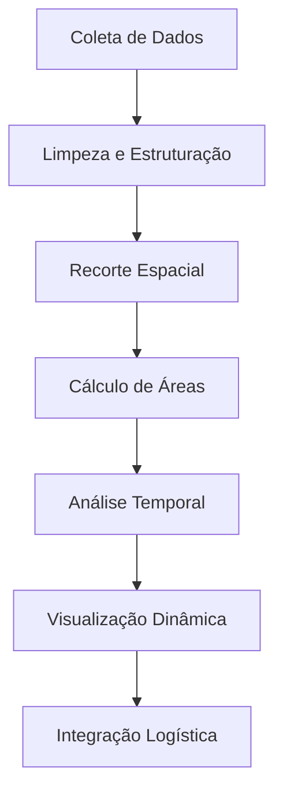

# Metodologia de Análise Geoespacial — Sinop Agro-GIS

Este documento detalha o framework metodológico aplicado no projeto **Sinop Agro-GIS** para mapear, analisar e quantificar a evolução do uso do solo e da infraestrutura logística no município de Sinop-MT, o coração do agronegócio no Norte de Mato Grosso.

---

## 🎯 Objetivo do Projeto

O objetivo principal deste projeto é analisar de forma integrada a dinâmica de expansão agrícola e a evolução da infraestrutura logística em Sinop-MT, correlacionando o avanço das culturas temporárias (com destaque para a soja e o milho safrinha) sobre a vegetação nativa com os indicadores de produção e a infraestrutura viária e de armazenagem local.

---

## 📦 Fontes de Dados Utilizadas

O estudo integra quatro grandes grupos de dados públicos e abertos:

1. **MapBiomas (Coleção 10.1):**
   - **Tipo:** Dados Raster (GeoTIFF, resolução espacial de 30 metros).
   - **Finalidade:** Mapear e classificar o uso e cobertura do solo anual de 2000 a 2024.
   - **Camadas analisadas:** Floresta Nativa, Formação Savânica, Pastagem, Agricultura (Soja, Algodão, Outras Lavouras), Área Urbana, Corpos d'Água e Áreas Úmidas.

2. **IBGE Produção Agrícola Municipal (PAM - Tabela 5457):**
   - **Tipo:** Dados Tabulares (CSV).
   - **Finalidade:** Obter dados históricos (2010–2023) de área plantada (ha), produção obtida (t) e rendimento médio (kg/ha) para as principais culturas (soja, milho e algodão).

3. **IBGE Malha Municipal (2022):**
   - **Tipo:** Dados Vetoriais (Shapefile, CRS geográfico SIRGAS 2000).
   - **Finalidade:** Recorte espacial oficial do limite político-administrativo do município de Sinop e do estado de Mato Grosso.

4. **OpenStreetMap (OSM) / DNIT:**
   - **Tipo:** Dados Vetoriais (Shapefile e API Overpass).
   - **Finalidade:** Mapeamento da malha de transportes (rodovias federais, estaduais e vias locais), ferrovias e pontos de interesse (silos, armazéns de grãos e indústrias de escoamento).

---

## ⚙️ Fluxo Geral de Processamento (Pipeline)

O projeto segue um fluxo de trabalho estruturado para garantir reprodutibilidade e integridade metodológica:

### 1. Coleta de Dados (`Coleta`)
Os dados de limites territoriais (IBGE) e malha viária preliminar são obtidos automaticamente via script de download. Os dados pesados do MapBiomas (rasters anuais) e as séries de safras da SIDRA/IBGE são baixados conforme guias específicos de download manual para garantir o uso correto das coleções mais recentes.

### 2. Limpeza e Estruturação (`Limpeza`)
Padronização de formatos, codificação de caracteres (UTF-8), tratamento de dados faltantes (NaN) e filtragem de tabelas estatísticas nacionais para restringir o escopo ao município de Sinop-MT (código municipal IBGE: `5107909`).

### 3. Recorte Espacial (`Recorte`)
Processamento geométrico no QGIS e via GeoPandas para realizar o recorte (*clip*) das camadas estaduais de rodovias e do raster de uso do solo com base no polígono limítrofe de Sinop-MT, reduzindo significativamente o volume de dados e o tempo de processamento das etapas seguintes.

### 4. Cálculo de Áreas (`Cálculo`)
Conversão dos sistemas de coordenadas geográficas (graus) para coordenadas projetadas métricas (**SIRGAS 2000 / UTM Zone 21S - EPSG:31981**). Isso permite realizar medições precisas em metros e hectares:
- Extensão em quilômetros de vias por classe.
- Densidade viária municipal ($km/km^2$).
- Contagem de pixels do MapBiomas convertidos em área real ($ha$).

### 5. Análise Temporal (`Temporal`)
Cruzamento da evolução das classes de cobertura do solo (MapBiomas) com a série de área plantada e volume de grãos (IBGE SIDRA). Cálculo de taxas de crescimento composto anual (CAGR) e análises de correlação de Pearson entre o avanço da soja e a perda de floresta nativa.

### 6. Visualização (`Visualização`)
Geração de gráficos interativos com Plotly e mapas interativos baseados em Leaflet/Folium para o dashboard web (`index.html`), além da exportação de gráficos estáticos de alta resolução para apresentações e publicações técnicas.

### 7. Integração Logística (`Logística`)
Espacialização das vias de escoamento (como o eixo central da BR-163) e a proximidade com os armazéns e silos cadastrados. Análise da capacidade viária de suporte ao tráfego pesado de grãos das lavouras até os centros consolidados de armazenagem.

---

## 📈 Consolidação de Métricas e Padrões Analíticos

Para garantir consistência e reprodutibilidade científica, o projeto adota os seguintes padrões numéricos e conceituais consensuais:

1. **Área de Soja (2024):** O valor técnico exato medido via sensoriamento remoto é **169.851,83 ha** (usado em análises de alta precisão). Textualmente, o valor é padronizado para **169.852 ha** (arredondamento matemático padrão).
2. **Área Territorial Municipal:** A área de referência político-administrativa oficial de Sinop-MT é de **3.990,3 km²** (vetor de limites do IBGE 2022). A soma de pixels da cobertura raster (MapBiomas) resulta metodologicamente em **399.085,86 ha** (~3.990,86 km²) devido à discretização e efeitos de borda da célula raster de 30 metros.
3. **Correlação Soja vs. Floresta:** O coeficiente adotado para fins textuais e no dashboard é de **-0,99** (Pearson r = -0,9937 exato nos cálculos computacionais).
4. **Malha Viária e BR-163:** A malha de escoamento agroindustrial principal filtrada totaliza **1.842,15 km** (com a BR-163 simplificada em um eixo central de **72,82 km**). A malha geográfica OSM total de linhas brutas acumula **3.640,42 km** (e **81,21 km** de feições de pistas da BR-163) por conta da inclusão de acessos secundários locais e pistas duplas mapeadas em duplicidade paralela.
5. **Nomenclatura SIDRA:** A fonte oficial de dados declaratórios agrícolas é a **Tabela 5457** do IBGE/SIDRA (Produção Agrícola Municipal - PAM), com a Tabela 1613 tratada como referência antiga.
6. **Período Temporal:** A série temporal de cobertura do solo cobre de **2000 a 2024** (MapBiomas Col. 10.1). A série de dados agrícolas cobre de **2010 a 2023** (limitação de publicação oficial do IBGE PAM até o momento).
